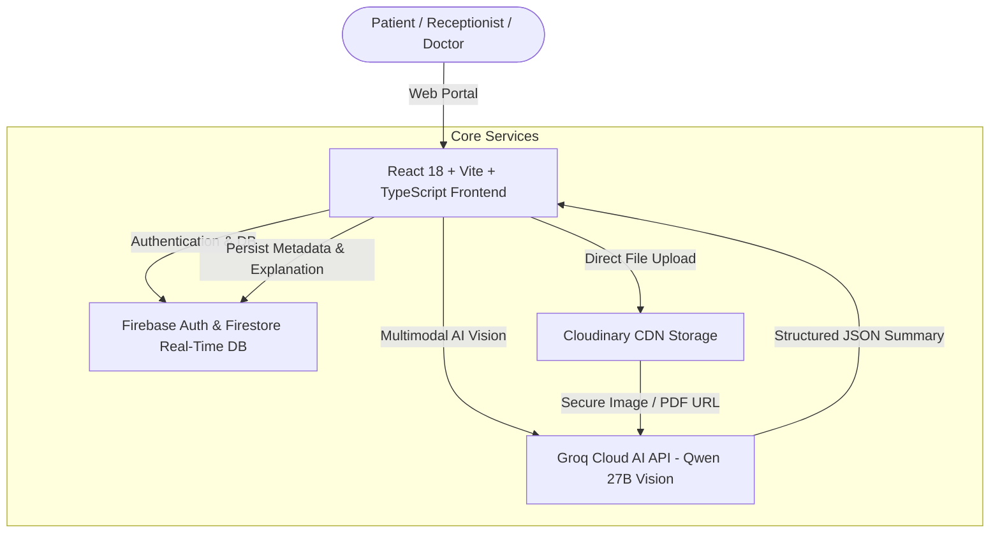

# 🏥 MediPass — Universal Health Passport & Intelligent Document Pipeline

> **Empowering patients and clinicians with instant OP check-in, real-time consultation queues, and AI-powered multi-page document intelligence.**

[](https://medipass-admin.web.app)
[](https://medipass-admin.web.app)
[-orange?style=for-the-badge)](https://medipass-admin.web.app)

---

## 🌟 Pitch & Problem Statement

### ❌ The Challenge in Modern Healthcare
- **Illegible Doctor Handwriting & Abbreviations**: Patients frequently leave clinics unable to read handwritten OPD case papers or interpret medical jargon (`OD/OS`, `IOP`, `NCTP`, `c/o`, `h/o`).
- **Fragmented Medical Histories**: Patients carry bulky physical files or lose past prescriptions, forcing doctors to make decisions without historic vitals or lab trends.
- **Queue Bottlenecks**: Long registration queues at hospital reception desks cause unnecessary delays for urgent OPD consultations.

### ✅ The MediPass Solution
**MediPass** bridges the gap between complex clinical records and clear patient understanding through a unified, multi-role digital health passport platform:
1. **Instant Phone / QR Access**: Zero-friction login for patients to access complete longitudinal records.
2. **AI Vision Document Intelligence**: Processes uploaded physical prescriptions, diagnostic scans, and multi-page lab reports directly through multimodal AI Vision, converting handwritten notes into structured, plain-English advice.
3. **Role-Based Clinical Workflows**: Tailored portals for **Patients**, **Hospital Receptionists**, **Attending Physicians**, and **System Administrators**.
4. **Embedded Dashboard Viewer**: View original document scans and PDF attachments directly inside the dashboard with tabbed page navigation.

---

## 🚀 Key Features

### 👤 1. Patient Portal & Digital Health Passport
- **Real-Time Visit Tracker**: Live updates on OPD queue status, doctor consultation stage, and check-in confirmation.
- **Page-Wise Multi-File AI Summaries**: Instant translation of uploaded prescriptions into:
  - 📝 **Plain-English Summary**
  - 🔬 **Key Document Findings & Measurements**
  - 💊 **Prescribed Medication Guidance & Schedule**
  - ⚠️ **Precautions & Medical Advice**
- **Embedded Document Viewer**: Interactive image zoom and embedded PDF viewer directly within the dashboard — no external popups needed.
- **Mobile OTP Authentication**: Secure, friction-free login with registered phone numbers.

### 🏥 2. Hospital Reception Desk Triage
- **Fast Session Creation**: Generate OP numbers and assign patients to active consultation queues.
- **Vitals Capture**: Input blood pressure, heart rate, temperature, SpO2, and weight during check-in.
- **Batch Document Upload**: Attach multi-page records directly to active sessions with live Cloudinary byte progress indicators.

### 🩺 3. Doctor Consultation Portal
- **Real-Time Patient Queue**: Instant synchronization with active patient visits.
- **Longitudinal History View**: Read-only clinical history of past visits, vitals, and diagnostic attachments.
- **Embedded Multi-Page Inspector**: Examine full high-resolution document scans and AI-extracted clinical notes during consultations.

---

## 🏗️ System Architecture



---

## 🛠️ Tech Stack & Architecture

| Layer | Technologies Used |
| :--- | :--- |
| **Frontend Framework** | React 18, TypeScript, Vite |
| **Styling & UI** | TailwindCSS, Lucide Icons, Glassmorphism & Micro-animations |
| **Database & Real-time** | Firebase Firestore (Real-time listeners & atomic transactions) |
| **Authentication** | Firebase Auth (Phone OTP & Custom Token Auth) |
| **Storage & CDN** | Cloudinary Direct Upload API (with byte-level progress tracking) |
| **AI Vision Engine** | Groq SDK (`qwen/qwen3.8-27b` Multimodal Vision Model) |
| **Hosting & Deployment** | Firebase Hosting |

---

## ⚡ Quick Start & Local Setup

### 1. Prerequisites
- **Node.js**: `v18.0.0` or higher
- **npm**: `v9.0.0` or higher

### 2. Clone Repository & Install Dependencies
```bash
git clone https://github.com/your-username/medipass.git
cd medipass
npm install
```

### 3. Environment Configuration
Create a `.env` file in the root directory:
```env
# Groq AI Key
VITE_GROQ_API_KEY=your_groq_api_key_here
VITE_GROQ_MODEL=qwen/qwen3.8-27b

# Firebase Configuration
VITE_FIREBASE_API_KEY=your_firebase_key
VITE_FIREBASE_AUTH_DOMAIN=your_project.firebaseapp.com
VITE_FIREBASE_PROJECT_ID=your_project_id
VITE_FIREBASE_STORAGE_BUCKET=your_project.appspot.com
VITE_FIREBASE_MESSAGING_SENDER_ID=your_sender_id
VITE_FIREBASE_APP_ID=your_app_id

# Cloudinary Configuration
VITE_CLOUDINARY_CLOUD_NAME=your_cloud_name
VITE_CLOUDINARY_UPLOAD_PRESET=your_unsigned_preset
```

### 4. Run Development Server
```bash
npm run dev
```
Open [http://localhost:5173](http://localhost:5173) in your browser.

### 5. Build & Deploy
```bash
npm run build
npx firebase-tools deploy --only hosting
```

---

## 🔐 Clinical Verification & Medical Disclaimer

> ⚠️ **Medical AI Disclaimer**: MediPass AI tools are designed as supportive patient education assistants. All AI-generated summaries include mandatory clinical verification notices advising patients to double-check advice against original physical document scans and consult attending healthcare providers for medical decisions.

---

## 📜 License & Acknowledgments
- Dedicated to improving healthcare accessibility, patient clarity, and hospital efficiency.
