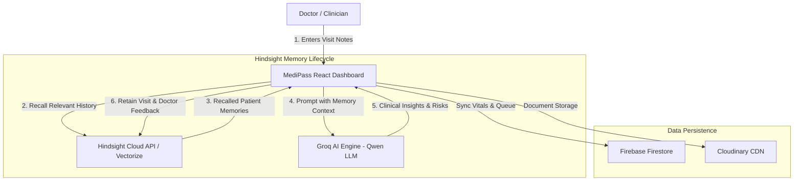

# 🏥 MediPass — Hindsight-Powered Medical Intelligence Agent & Universal Health Passport

> **Empowering clinicians with persistent patient memory across visits, dynamic treatment outcome learning, and real-time clinical intelligence powered by Vectorize Hindsight.**

[](https://vectorize.io)
[](https://github.com/jaigudivada/Medipass-demo)
[](https://groq.com)

---

## 🌟 Overview & Problem Statement

### ❌ The Challenge in Longitudinal Healthcare
- **Memory Loss Between Visits**: Doctors see dozens of patients daily and cannot recall specific past medication reactions, subtle trend progression, or historical treatment outcomes for every patient.
- **Fragmented Medical Histories**: Patients carry bulky physical files or lose past prescriptions, forcing clinicians to make decisions without historic vitals or lab trends.
- **Static LLMs Lack Context**: Standard AI assistants analyze single visits in isolation without learning how a specific patient responded to prior treatments.

### ✅ The MediPass Solution
**MediPass** turns standard clinical documentation into an adaptive, memory-powered medical agent:
1. **Persistent Patient Memory Banks**: Every patient gets a dedicated Hindsight memory bank (`medipass-patient-{patientId}`) that grows continuously across clinical encounters.
2. **Context-Aware Clinical Recall**: Before generating clinical insights, MediPass recalls historical visit records, allergies, family risk factors, and prior treatment responses.
3. **Treatment Outcome Learning**: Doctors can confirm, modify, or reject AI recommendations. Doctor feedback is retained into Hindsight to refine future recommendations.
4. **Role-Based Workflows**: Dedicated interfaces for Patients, Hospital Receptionists, Attending Physicians, and Administrators.

---

## 🧠 How Hindsight Memory Is Used in MediPass

MediPass leverages the Vectorize Hindsight SDK (`@vectorize-io/hindsight-sdk`) to provide intelligent longitudinal memory:

### 1. `createBank` — Dedicated Patient Memory Isolation
Each patient receives a dedicated memory bank (`medipass-patient-{patientId}`). Memory banks are initialized with clinical background context establishing the agent's persistent role as a longitudinal medical assistant.

```typescript
await client.createBank(`medipass-patient-${patientId}`, {
  name: `MediPass Agent — ${patientName}`,
  background: `Persistent Medical Intelligence Agent for ${patientName}...`
});
```

### 2. `retain` — Continuous Visit & Feedback Storage
Every clinical interaction is indexed into Hindsight:
- **Visit Documentation**: Symptoms, vitals, lab findings, and clinical summaries are retained after each appointment.
- **Doctor Feedback Loop**: When a doctor confirms, modifies, or rejects a recommendation, the outcome signal is stored into Hindsight so the agent adapts to clinical preferences.

```typescript
await client.retain(bankId, visitContent, {
  timestamp: new Date(),
  metadata: { type: 'visit_history', doctorId }
});
```

### 3. `recall` — Semantic Retrieval Across Past Visits
When a doctor enters new visit notes, MediPass queries Hindsight with a semantic recall budget (`budget: 'mid'`). Relevant historical memories, allergy warnings, and past treatment outcomes are injected into the Groq prompt context.

```typescript
const recalled = await client.recall(bankId, recallQuery, { budget: 'mid' });
```

### 4. `reflect` & Outcome Learning — Dynamic Recommendation Tuning
By evaluating doctor feedback over time, Hindsight enables the agent to recognize recurring patient patterns (e.g., medication intolerance, dosage sensitivities) and improve recommendation accuracy with each visit.

---

## 🏗️ System Architecture



---

## 🛠️ Tech Stack & Layer Responsibility

| Layer | Technologies Used | Purpose |
| :--- | :--- | :--- |
| **Memory Engine** | **Hindsight (`@vectorize-io/hindsight-sdk`)** | **Persistent patient memory bank across visits, semantic recall, & outcome learning** |
| **AI Reasoning** | Groq SDK (`qwen/qwen3.8-27b` / `llama-3.3-70b`) | Multimodal LLM reasoning using Hindsight recalled memory context |
| **Database & Real-time** | Firebase Firestore | Real-time queue sync, patient metadata, and clinical session tracking |
| **Authentication** | Firebase Auth | Role-based authentication (Patient, Receptionist, Doctor, Admin) |
| **Storage & CDN** | Cloudinary CDN | High-resolution medical prescription & diagnostic document storage |
| **Frontend Framework** | React 18, TypeScript, Vite | Modern responsive clinical web interface |

---

## ⚡ Quick Start & Local Setup

### 1. Prerequisites
- **Node.js**: `v18.0.0` or higher
- **npm**: `v9.0.0` or higher

### 2. Clone Repository & Install Dependencies
```bash
git clone https://github.com/jaigudivada/Medipass-demo.git
cd Medipass-demo
npm install
```

### 3. Environment Configuration
Create a `.env` file in the root directory:

```env
# Vectorize Hindsight Configuration
VITE_HINDSIGHT_INSTANCE_URL=https://api.hindsight.vectorize.io
VITE_HINDSIGHT_API_KEY=your_hindsight_api_key

# Groq AI Key
VITE_GROQ_API_KEY=your_groq_api_key
VITE_GROQ_MODEL=qwen/qwen3.8-27b

# Firebase Configuration
VITE_FIREBASE_API_KEY=your_firebase_key
VITE_FIREBASE_AUTH_DOMAIN=your_project.firebaseapp.com
VITE_FIREBASE_PROJECT_ID=your_project_id
VITE_FIREBASE_STORAGE_BUCKET=your_project.appspot.com
VITE_FIREBASE_MESSAGING_SENDER_ID=your_sender_id
VITE_FIREBASE_APP_ID=your_app_id
```

### 4. Seed Demo Patient History into Hindsight
Seed sample patient history (`patient_001` - Jai Gudivada) with 4 sequential visits into Hindsight Cloud memory:

```bash
npm run seed:demo-history
```

This populates Hindsight bank `medipass-patient-patient_001` with:
- Visit 1: Initial Hypertension & Migraine Assessment
- Visit 2: Amlodipine Side-Effect & Medication Adjustment
- Visit 3: Blood Pressure Stabilization & Work Stress Check
- Visit 4: Comprehensive Follow-Up & Dosage Optimization

### 5. Run Development Server
```bash
npm run dev
```
Open [http://localhost:5173](http://localhost:5173) in your browser.

---

## 🔐 Clinical Verification & Medical Disclaimer

> ⚠️ **Medical AI Disclaimer**: MediPass AI insights and Hindsight recall are designed as clinical decision-support tools. All AI-generated advice requires verification by licensed medical professionals before clinical implementation.

---

## 📜 License & Acknowledgments
Built with ❤️ using Vectorize Hindsight, Groq AI, and Firebase.
